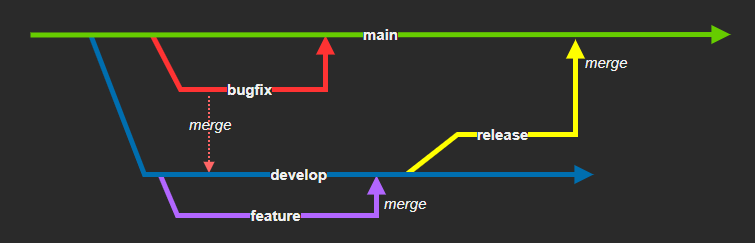

# Git Flow with Django

Project to learn Django commands versioned with Git Flow.



## Setup

```sh
python3 -m venv env
. env/bin/activate
pip install -r requirements.txt
```

To add new app:

```sh
django-admin startapp '<name_of_the_app>'
```

Run it:

```sh
python manage.py runserver
```

## Git Flow

### Develop Branch

Create `develop` branch

```shell
git checkout -b develop
git push origin develop
git branch -a
```

### Feature Branch

Create branch from `develop`, stage and commit:

```shell
git checkout -b purepython develop
git add .
git status
git commit -m "first commit"
```

Merge:

```shell
git checkout develop
git merge --no-ff purepython
git push origin develop
git branch -d purepython
```

### Release Branch

Change, stage, commit, merge to `main`, tag, and push:
```shell
git checkout -b release-1.2
git commit -a -m "some change"
git checkout main
git merge --no-ff release-1.2
git tag -a 1.2 -m "new release 1.2"
git push --tags origin main
```

Merge to `develop` and delete release:

```shell
git checkout develop
git merge --no-ff release-1.2
git branch -d release-1.2
```

### Hotfix Branch

Create `hotfix` branch, bump version and fix the problem:

```shell
git checkout -b hotfix-1.2.1 main
./bump-version.sh 1.2.1
git commit -a -m "Bumped version number to 1.2.1"
git commit -m "Fixed severe production problem"
```

Merge to `main`, tag and push (with tags):

```shell
git checkout main
git merge --no-ff hotfix-1.2.1
git tag -a 1.2.1
git push --tags origin main
```

Merge to `develop` and delete branch:

```shell
git checkout develop
git merge --no-ff hotfix-1.2.1
git push --tags origin develop

git branch -d hotfix-1.2.1
```

## Sources

Django

https://www.django-rest-framework.org/tutorial/quickstart/

https://dfpp.readthedocs.io/en/latest/chapter_01.html

Git Flow

https://githowto.com/

https://danielkummer.github.io/git-flow-cheatsheet/
